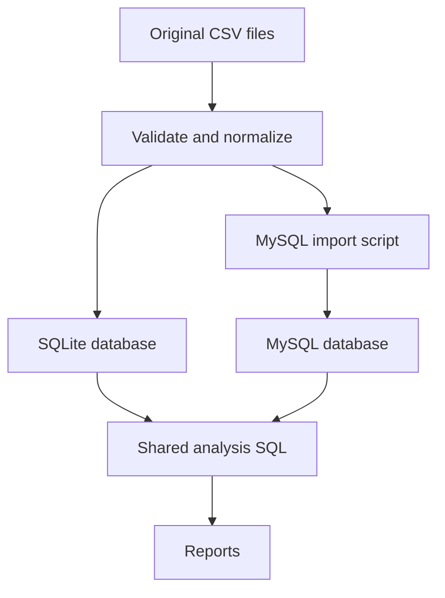

# Architecture

The project is deliberately small: it is an analytical pipeline, with SQL as the main business-logic layer. There is no web server or ORM because neither is needed to answer these questions.

## Data model and grain

`city` has one row per city. `customers` has one row per registered customer and belongs to one city. `products` has one row per product ID. `sales` has one row per recorded sale of a product by a customer. `calendar_months` has one row per month between the first and last sales months.

A sale has no quantity or order ID. Therefore `COUNT(sale_id)` measures recorded sales, not independently verified units or checkout orders. Product IDs 4 and 9 share a name but have different prices; grouping by product ID keeps them separate.

`city_metrics` is a view, not a duplicated summary table. It calculates revenue, active purchasing customers and recorded sale counts. Queries reuse it so customer denominators remain consistent. Zero-sale cities survive because joins begin from city and use LEFT JOIN.

## Separation of responsibilities

The loader reads CSV bytes, handles UTF-8/Windows-1252, checks columns, validates primary and foreign keys, parses dates and stores amounts as Decimal. It recognizes the original special-product IDs 21–28 explicitly; this is a source-specific classification, not a guess based on a product name. Update this mapping for another catalogue.

The database module handles schema creation and writes. It uses bound parameters for SQLite records. MySQL export uses fixed, internal column names and quoted values with apostrophes escaped; the script sets `NO_BACKSLASH_ESCAPES`. It batches 500 rows per INSERT so import size stays manageable.

The runner coordinates these modules. It loads once, executes each numbered SQL file and writes CSVs. CSV exports use blank cells for SQL NULL; zero remains zero. On validation failure it exits with a file and line number. It never mutates the original CSVs.

## Why these database choices?

MySQL is the intended SQL learning target. The optional SQLite runner makes the project immediately reproducible using Python's standard library and provides a convenient validation harness. It is not a claim that all SQLite behavior is identical to MySQL. If the data becomes large, import directly into MySQL and run the same reports there.

Primary keys prevent duplicate records; foreign keys prevent orphan sales and customers; CHECK constraints reject invalid amounts and ratings. Indexes support city/customer joins, product aggregations and date filtering. Indexes have write and storage costs, and aggregated all-time reports still scan many sales. Examine `EXPLAIN` on your actual MySQL server before adding more indexes.

## Changes from the original

- PostgreSQL `::numeric` casts and quarter extraction were replaced by shared expressions and an index-friendly half-open date range.
- Monetary fields use DECIMAL, not FLOAT, in MySQL.
- Queries have semicolons, explicit grouping columns and deterministic tie ordering.
- Exactly three products per city are returned using ROW_NUMBER. DENSE_RANK could return more than three when counts tie; use that if you want three rank tiers instead.
- The expansion query now actually applies LIMIT 3.
- Monthly growth includes calendar months with no sales. A missing month is zero, rather than silently comparing nonadjacent months. Previous zero revenue yields NULL growth because the percentage is undefined.
- Monthly grouping includes the year through an ISO month date.
- Inactive cities and products remain visible where relevant.
- Source encodings, trailing empty export columns and date format are handled explicitly.

## Testing scope

The suite checks totals against independent Decimal sums, Q4 dates against raw parsed records, the dataset's revenue shortlist, per-city limits, inactive cities, missing months, undefined growth, foreign keys and duplicate source IDs. MySQL should also be exercised locally using the generated script; it was not available during build.
